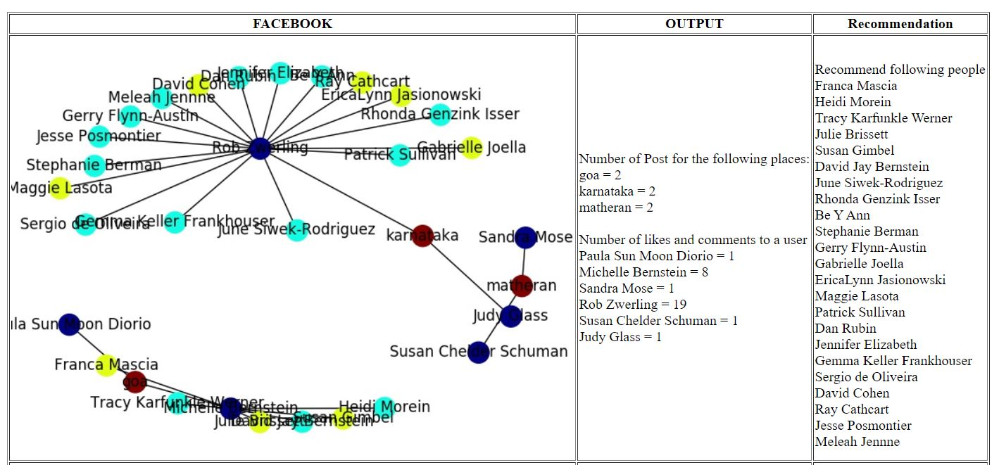
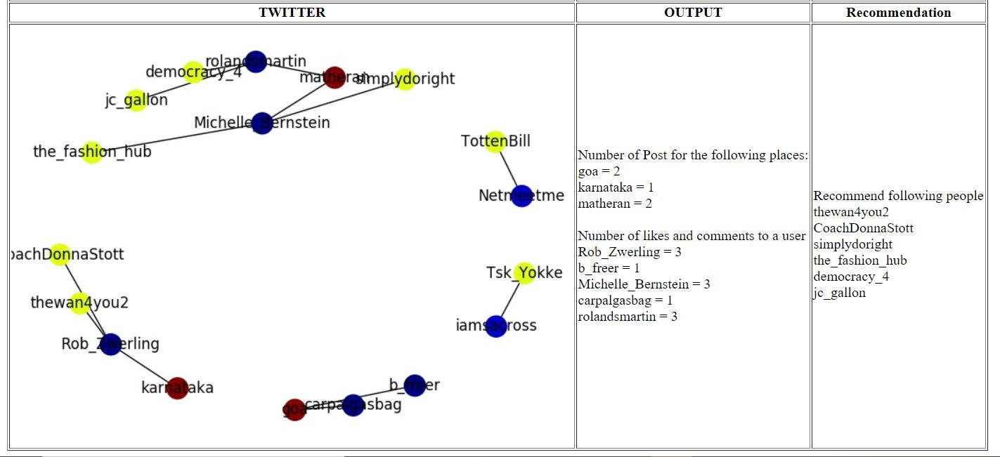

# Twitter-Facebook-Analysis
The project uses comments, likes, posts, tweets to analyze relation between different users by place liking using graphical approach.

Tech Stack:
Python, MatplotLib, Pandas, Numpy, Networkx Graph

Facebook Graph Snapshot:

Twitter Graph Snapshot:

